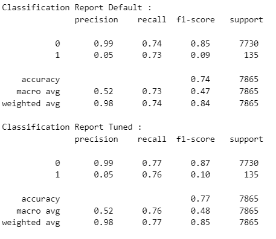
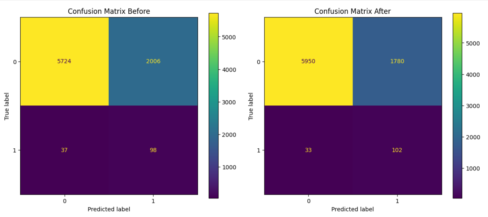

# Travel Insurance Claim Detection
### Created By : Stefanus William Alexander

## Business Problem Understanding
**Context**  

Perusahaan travel asuransi memiliki fokus utama untuk melindungi pelanggan dari risiko selama perjalanan, seperti pembatalan perjalanan, kehilangan bagasi, keterlambatan penerbangan, atau kebutuhan medis darurat. Namun, tidak semua pelanggan mengajukan klaim meskipun memiliki polis asuransi, sehingga terdapat pola klaim yang dapat dianalisis. Data pemegang polis di perusahaan asuransi merupakan data historis, terdiri dari destinasi, produk asuransi, dan sebagainya.

**Problem Statement :**

Perusahaan ingin meningkatkan efisiensi operasional dan profitabilitas dengan memprediksi apakah seorang pelanggan kemungkinan besar akan mengajukan klaim asuransi perjalanan atau tidak. Hal ini bertujuan untuk:

1. Manajemen Risiko: Mengidentifikasi pelanggan dengan risiko klaim tinggi sehingga dapat disesuaikan premi atau kebijakan layanan.
2. Optimalisasi Proses Klaim: Memprioritaskan klaim pelanggan yang benar-benar valid untuk mempercepat pemrosesan.

**Goals :**

Maka berdasarkan permasalahan tersebut, perusahaan ingin memprediksi apakah seorang pelanggan akan mengajukan klaim atau tidak (Claim: Yes/No) berdasarkan data pelanggan, perjalanan, dan produk asuransi. Sehingga dapat memenuhi 3 tujuan yaitu:
1. Prediksi yang Akurat: Menggunakan data pelanggan dan perjalanan untuk memprediksi klaim secara akurat.
2. Mengurangi Kerugian Finansial: Mengelola biaya klaim dengan lebih baik melalui prediksi resiko klaim.
3. Peningkatan Pelayanan: Memberikan pengalaman pelanggan yang lebih baik dengan mempercepat penanganan klaim.

**Analytic Approach :**

Memprediksi apakah pelanggan akan mengajukan klaim asuransi perjalanan atau tidak (Claim: Yes/No) menggunakan data pelanggan, perjalanan, dan informasi produk dari data historikal pelanggan sebelumnya. Fokus utamanya adalah mengurangi false negatives (klaim valid yang tidak terdeteksi) dan meningkatkan recall.

Type 1 error : False Positive  
- Model memprediksi bahwa customer akan melakukan klaim (berisiko), tetapi kenyataannya customer tersebut tidak melakukan klaim.
- Dampak : 
    - Overpricing Premi (Premi Terlalu Tinggi):
        - Karena model memprediksi customer sebagai berisiko tinggi, perusahaan mungkin menaikkan premi untuk mencerminkan risiko tersebut.
        - Jika premi terlalu mahal, customer yang sudah ada mungkin merasa tidak puas dan berhenti memperpanjang polis (churn), sehingga perusahaan kehilangan pendapatan dari premi mereka.
    - Hilangnya Pelanggan Loyal:
        - Customer yang merasa diperlakukan tidak adil karena premi yang terlalu mahal mungkin mencari alternatif lain (kompetitor).
        - Kehilangan pelanggan loyal dapat mengurangi pendapatan jangka panjang. 
    - Inefisiensi Alokasi Sumber Daya:
        - Perusahaan mungkin mengalokasikan sumber daya tambahan (misalnya, analisis risiko lebih dalam atau layanan pelanggan khusus) untuk pelanggan yang sebenarnya tidak membutuhkan perhatian ekstra.
        - Biaya operasional meningkat tanpa memberikan manfaat nyata.

Type 2 error : False Negative  
- Model memprediksi bahwa customer tidak akan melakukan klaim (tidak berisiko), tetapi kenyataannya customer tersebut melakukan klaim.
- Dampak : 
    - Klaim Tak Terduga:
        - Karena model salah memperkirakan bahwa customer tidak berisiko, perusahaan tidak memprioritaskan pelanggan ini untuk tindakan mitigasi risiko (misalnya, edukasi pelanggan, pengawasan ekstra, atau penyesuaian premi).
        - Ketika klaim terjadi, perusahaan harus membayar nilai klaim secara penuh, yang bisa sangat besar jika klaimnya signifikan (misalnya, kecelakaan besar atau kehilangan barang mahal).
    - Premi yang Tidak Sesuai (Underpricing):
        - Jika pelanggan ini sebenarnya berisiko tinggi tetapi diprediksi tidak berisiko, premi yang ditetapkan mungkin terlalu rendah untuk menutupi potensi klaim.
        - Kerugian: Premi yang diterima tidak cukup untuk menutupi biaya klaim.
    - Kerugian pada Profitabilitas:
        - Setiap klaim yang tidak diprediksi akan mengurangi margin keuntungan perusahaan, terutama jika pelanggan tersebut adalah bagian dari segmen yang dianggap "aman" dan tidak dialokasikan premi risiko.

**Setelah dilakukan data cleaning :**
- Jumlah data : 44328 -> 39324 (-11.2%) = Hal ini dikarenakan adanya penghapusan data duplikat sebesar 4667 data (11.2%), agar tidak terjadi bias data saat proses pembelajaran model machine learning.
- Jumlah kolom : 11 -> 10 = Hal ini dikarenak adannya penghapusa kolom 'Gender' yang memiliki data null/kosong sebesar 31647 data (71.39%)
- Pengkategorian ulang pada unik data kolom kategorikal :
    - Kolom `Agency` : 16 -> 5 unik data.
    - Kolom `Product Name` : 26 -> 6 unik data.
    - Kolom `Destination` : 138 -> 6 unik data.

**Data Preparation :**

Proses preprocessing pada fitur-fitur yang kita miliki akan dilakukan encoding dan scaling yang dibagi menjadi seperti berikut:
- Encoding
    - kolom `Agency` merupakan kolom kategorikal dengan jumlah unik data 5. (**One Hot Encoder**)
    - kolom `Agency Type` merupakan kolom kategorikal dengan jumlah unik data 2. (**One Hot Encoder**)
    - kolom `Distribution Channel` merupakan kolom kategorikal dengan jumlah unik data 2. (**One Hot Encoder**)
    - kolom `Product Name` merupakan kolom kategorikal dengan jumlah unik data 6. (**One Hot Encoder**)
    - kolom `Destination` merupakan kolom kategorikal dengan jumlah unik data 6. (**One Hot Encoder**)
- Scaling
    - kolom `Duration` merupakan kolom numerikal dengan outlier. (**Robust Scaling**)
    - kolom `Net Sales` merupakan kolom numerikal dengan outlier. (**Robust Scaling**)
    - kolom `Commision (in value)` merupakan kolom numerikal dengan outlier. (**Robust Scaling**)
    - kolom `Age` merupakan kolom numerikal dengan outlier, tetapi berbeda dengan kolom numerikal lainnya, kolom `Age` berpengaruh kepada resiko asuransi maka perlunya pengelompokan ordinal untuk mempertahankan informasi tentang urutan umur. (**Binning Ordinal**)

**Cross Validation :**

- Model Benchmarking : K-Fold -> 	**BalancedRandomForestClassifier** (Model terbaik dari rata-rata score recall)
- Model Benchmarking : Test Data -> 	**BalancedRandomForestClassifier** (Model terbaik dari rata-rata score recall)

**Hyperparameter Tuning :**

- Default hyperparameter **BalancedRandomForestClassifier** : 
    - `n_estimators` = 100
    - `criterion` = gini
    - `max_features` = sqrt
    - `min_samples_leaf` = 1
    - `min_samples_split` = 2
    - `max_depth` = None

Recall Score Default Balanced Random Forest Classifier : **0.725925925925926**

- Tuning hyperparameter **BalancedRandomForestClassifier** :
    - `n_estimators` = 175
    - `criterion` = entropy
    - `max_features` = log2
    - `min_samples_leaf` = 1
    - `min_samples_split` = 5
    - `max_depth` = 14

Recall Score Tuned Balanced Random Forest Classifier : **0.7555555555555555**

Dilihat dari Classification report model **Balanced Random Forest Classifier** setelah di tuning berhasil mengoptimalkan Recall score. Oleh karena itu **Balanced Random Forest Classifier** setelah di tuning akan digunakan.

**Confusion Metrics :**

Dari visualisasi diatas membuktikan bahwa model **Balanced Random Forest Classifier** setelah dituning berhasil menurunkan :
- **FN** : 37 -> 33 (-10.8%)
- **FP** : 2006 -> 1780 (-11.2%)

Maka dari hasil Confusion Metrics diatas, kita dapat melakukan perhitungan biaya kerugian untuk mengetahui apakah model dapat mengurangi kerugian pada perusahaan :

- **FP** : Model memprediksi bahwa customer akan melakukan klaim (berisiko), tetapi kenyataannya customer tersebut tidak melakukan klaim.
    - Kerugian Langsung
        - Premi yang terlalu tinggi:

            - Jika pelanggan dianggap berisiko tinggi, perusahaan dapat menetapkan premi yang lebih tinggi.
            - Ini dapat menyebabkan pelanggan tersebut memilih tidak membeli polis karena merasa harga asuransi tidak sesuai dengan kebutuhannya.
            - Dampak: Kehilangan potensi pendapatan dari pelanggan yang seharusnya menjadi pelanggan tetap.

        - Biaya tambahan untuk pencegahan risiko:

            - Misalnya, perusahaan mungkin memberlakukan persyaratan tambahan seperti inspeksi lebih ketat atau audit risiko yang membutuhkan biaya.
            - Estimasi kerugian: Perusahaan mengeluarkan rata-rata Rp 500.000 per audit.
    
    - Kerugian Tidak Langsung
        - Hilangnya pelanggan potensial (reputasi):

            - Pelanggan yang merasa tidak adil (misalnya, dikenakan premi tinggi tanpa alasan jelas) dapat menyebarkan ulasan negatif atau beralih ke pesaing.
            - Jika perusahaan kehilangan 5% pelanggan dari kategori FP akibat penetapan premi tinggi, dan estimasi setiap pelanggan rata-rata menyumbang Rp 1.000.000 per tahun.
        
        - Inefisiensi operasional:

            - Waktu dan sumber daya yang dihabiskan untuk memantau pelanggan "berisiko tinggi" secara keliru mengurangi efisiensi perusahaan dalam menangani pelanggan yang benar-benar membutuhkan perhatian lebih.
            - Estimasi kerugian biaya tambahan untuk pengelolaan FP adalah Rp 100.000 per pelanggan.

    - Estimasi Kerugian FP setiap tahunnya : Total FP * (Rp 500.000 + Rp 100.000) + (Total FP * 5% * Rp 1.000.000)

- **FN** : Model memprediksi bahwa customer tidak akan melakukan klaim (tidak berisiko), tetapi kenyataannya customer tersebut melakukan klaim.
    - Kerugian Langsung
        - Pembayaran klaim yang besar tanpa persiapan:

            - Jika pelanggan dianggap tidak berisiko tetapi kemudian mengajukan klaim besar, perusahaan mungkin menghadapi kerugian besar karena tidak ada premi tambahan atau langkah mitigasi yang diterapkan.
            - Contoh:
                - Pelanggan dengan risiko tinggi seharusnya dikenakan premi tambahan Rp 500.000, tetapi tidak dikenakan karena salah klasifikasi.
                - Pelanggan tersebut mengajukan klaim Rp 10.000.000, yang akhirnya harus dibayar penuh.
                - Kerugian: Perusahaan kehilangan potensi premi tambahan dan harus membayar klaim penuh.

        - Peningkatan rasio klaim terhadap premi (loss ratio):

            - Karena pelanggan FN tidak dikenakan premi tinggi, klaim yang mereka ajukan bisa melebihi total premi yang dikumpulkan.
            - Dampak: Rasio klaim terhadap premi meningkat, mengurangi profitabilitas perusahaan.

     - Kerugian Tidak Langsung
        - Reputasi perusahaan:

            - Jika klaim besar dari pelanggan FN sulit dibayarkan karena tekanan finansial, hal ini dapat merusak kepercayaan pelanggan lain.
            - Contoh: Keterlambatan atau penolakan pembayaran klaim dapat menyebabkan ulasan buruk atau tuntutan hukum.
        
        - Hilangnya kesempatan mitigasi:

            - Perusahaan asuransi tidak dapat mengambil langkah proaktif, seperti menawarkan produk tambahan atau membatasi cakupan, untuk pelanggan FN.
            - Dampak: Klaim besar yang sebenarnya bisa diminimalkan akhirnya menjadi beban penuh.

    - Estimasi Kerugian FP setiap tahunnya :
        - Rata-rata klaim per pelanggan FN: Rp 15.000.000
        - Potensi premi tambahan yang hilang: Rp 1.000.000
        - Total FP * (Rp 15.000.000 + 1.000.000)

Maka hasil evaluasinya akan menjadi:

- Menggunakan default hyperparameter **BalancedRandomForestClassifier** :
    - FP : 2006 * (Rp 500.000 + Rp 100.000) + (2006 * 5% * Rp 1.000.000) = Rp 1.303.900.000
    - FN : 37 * (Rp 15.000.000 + 1.000.000) = Rp 592.000.000
    - Total Kerugian = Rp 1.895.900.000

- Menggunakan Tuning hyperparameter **BalancedRandomForestClassifier** :
    - FP : 1780 * (Rp 500.000 + Rp 100.000) + (1780 * 5% * Rp 1.000.000) = Rp 1.157.000.000
    - FN : 33 * (Rp 15.000.000 + 1.000.000) = Rp 528.000.000
    - Total Kerugian = Rp 1.685.000.000

Model **BalancedRandomForestClassifier** setelah di tuning, berhasil menurunkan kerugian perusahaan sebesar Rp.210.900.000 per tahun atau berkurang sebesar 11.1% kerugian perusahaan.

### Rekomendasi

- Monitor dan Evaluasi Secara Berkala : Risiko berubah seiring waktu; evaluasi rutin diperlukan untuk menyesuaikan strategi kedapannya.
    - Lakukan audit risiko tahunan untuk menilai efektivitas strategi ataupun kerugian yang mungkin diterima.
    - Gunakan dashboard data real-time untuk memantau metrik klaim, FP, dan FN secara berkala.
- Investasi dalam Teknologi dan Data : Pengelolaan data yang baik adalah dasar untuk membuat keputusan, karena dengan bukti diatas saja model machine learning mampu mengurangi kerugian perusahaan.
    - Gunakan AI dan big data untuk memahami pola klaim yang kompleks.
- Mencoba menggunakan algoritma, model dan metrik Machine Learning yang lain, mencoba kembali Hyperparameter Turning, dan menggunakan teknik Resampler yang berbeda.
- Menambahkan data terutama pada data target kelas 1 atau claim karena bisa dilihat data mengalami ketidakseimbangan yang ekstrim dengan ratio 98:2
    

